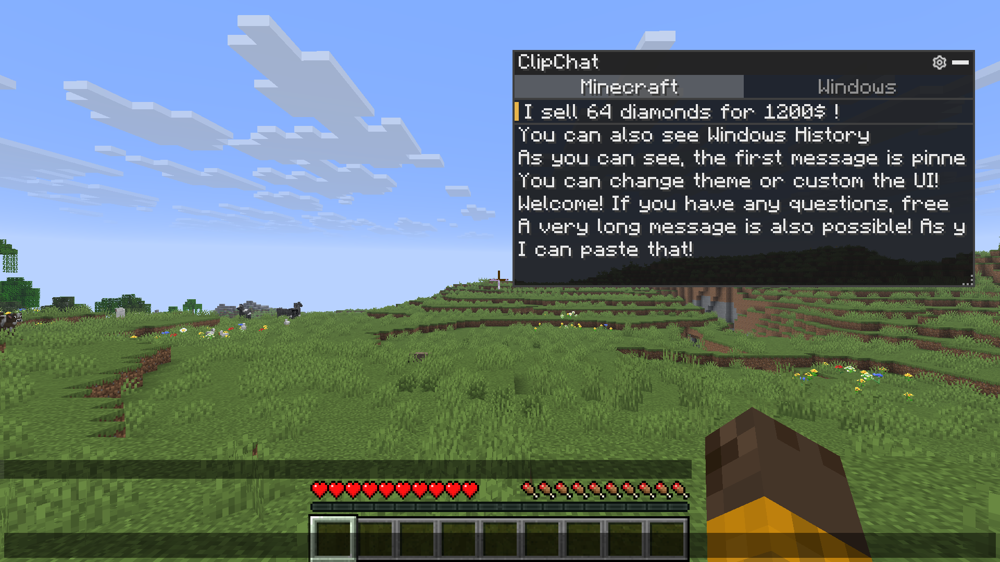
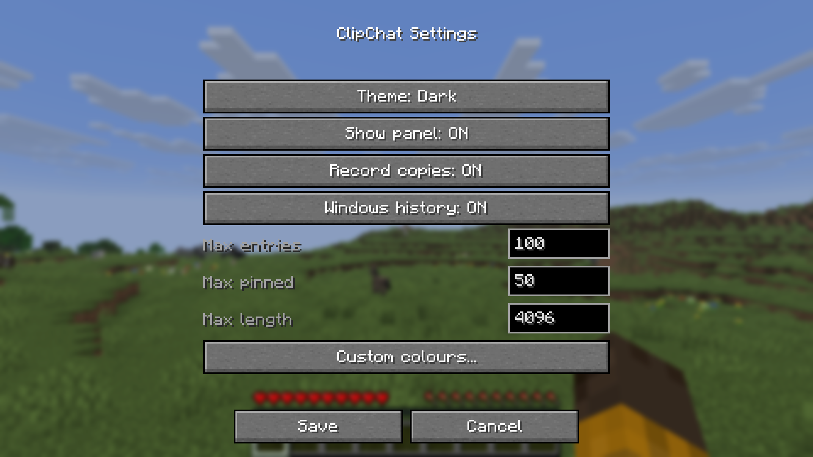
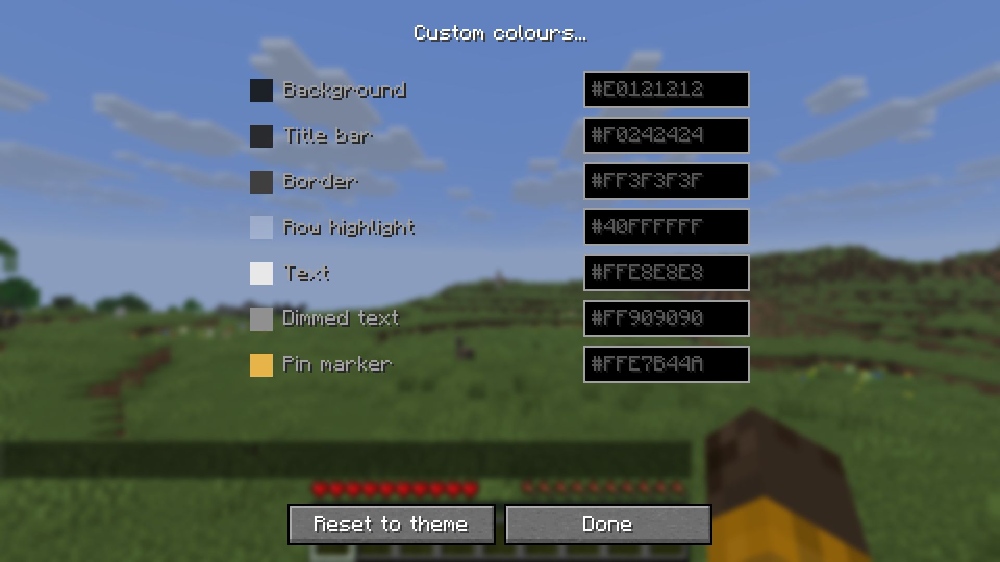
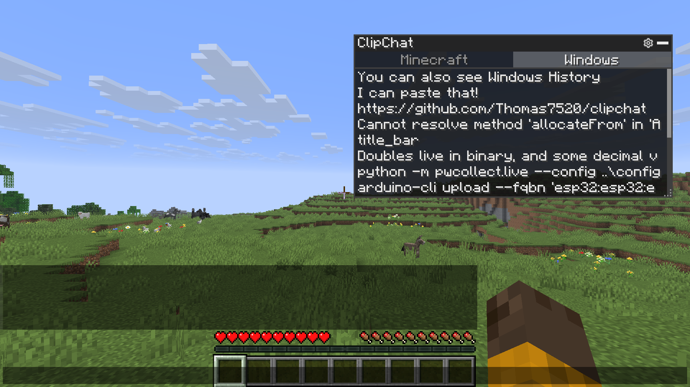

# ClipChat

A clipboard manager that lives inside the Minecraft chat screen. Open chat, click an entry, and it
is inserted at your cursor : no alt-tabbing to find that seed, coordinate or command again.

ClipChat is **client-side only**. It does nothing on a server and does not need to be installed on
one.

## Features

- **In-chat clipboard panel.** Everything you copy inside Minecraft is listed in the chat screen,
  newest first, and one click inserts it at your text cursor.
- **Pinning.** Pinned entries sort to the top and are never dropped to make room for new ones.
- **Full keyboard control.** Move, insert, pin and delete without leaving the keyboard.
- **A movable, resizable, collapsible panel.** Position, size and collapsed state are remembered
  between sessions.
- **Themes and per-colour overrides.** Four built-in themes, and every individual colour can be
  overridden by hand.
- **Optional Windows clipboard history tab.** Off by default. When enabled, browse the system
  clipboard history that Windows itself keeps, and insert from it directly.
- **Optional persistence.** Off by default. Your Minecraft clipboard history can survive a restart,
  or empty itself every time you quit.

## Supported platforms

| | |
|---|---|
| Windows | Fully supported, including the Windows clipboard history tab |
| macOS | Fully supported, except the Windows history tab |
| Linux | Fully supported, except the Windows history tab |

The Windows clipboard history tab additionally requires Windows 10 version 1809 or newer, with
clipboard history switched on in **Settings → System → Clipboard**.

## Installation

1. Install [Fabric Loader](https://fabricmc.net/use/) 0.15.11 or newer for Minecraft 1.20.1.
2. Download [Fabric API](https://modrinth.com/mod/fabric-api) 0.92.2+1.20.1 or newer and drop the jar
   into `.minecraft/mods/`.
3. Download the ClipChat jar and drop it into `.minecraft/mods/` as well.
4. Optionally install [Mod Menu](https://modrinth.com/mod/modmenu) if you want a settings button in
   the mod list.
5. Launch the game with the Fabric profile.

You need **Java 17** or newer. Recent Minecraft launchers install a suitable runtime automatically.

## Configuration

Settings can be reached in three ways:

- the gear icon in the panel's title bar,
- the `/clipchat` command,
- Mod Menu, if it is installed,
- or the **Open ClipChat settings** keybind (unbound by default : assign it under
  **Options → Controls → Key Binds**).

| Setting | Default | What it does |
|---|---|---|
| Show panel | On | Hides the panel entirely when off. Settings stay reachable via `/clipchat`. |
| Record copies | **Off** | Persists your Minecraft clipboard history to disk between sessions. |
| Windows history | **Off** | Adds the Windows tab, reading the system clipboard history live. |
| Theme | Dark | Dark, Light, High contrast or Classic. |
| Custom colours | — | Per-element colour overrides that take precedence over the theme. |
| Max entries | 100 | How many unpinned entries to keep before the oldest is dropped. 1–1000. |
| Max pinned | 50 | How many entries may be pinned at once. 1–500. |
| Max length | 4096 | Copied text longer than this is shortened before being stored. 16–65536. |

The four built-in themes : Dark and Light on the top row, High contrast and Classic below.

Any individual colour can be overridden on top of the chosen theme, and overrides are kept when you
switch theme.

Configuration files live under `.minecraft/config/clipchat/`. See
[Privacy](#privacy-what-is-stored-and-where) for exactly what each one holds.

## Keybindings and controls

The panel appears in the top right of the chat screen. Drag the title bar to move it, drag the
bottom-right grip to resize it, and click the bar in the title to collapse it.

| Action | Mouse | Keyboard |
|---|---|---|
| Move through entries | — | `Ctrl` + `Up` / `Down` |
| Insert into chat | Left click | `Ctrl` + `Enter` |
| Pin / unpin | Right click, or the pin icon | `Ctrl` + `P` |
| Delete | The cross icon | `Ctrl` + `Delete` |
| Switch source tab | Click the tab | `Ctrl` + `Left` / `Right` |
| Open settings | The gear icon | — |

Every shortcut is held behind `Ctrl` because the chat box keeps keyboard focus while the panel is
open: an unmodified arrow key belongs to Minecraft's sent-message history, and an unmodified letter
belongs in the message you are typing.

Long text is shortened to fit the chat box's 256-character limit when inserted.

## Privacy: what is stored, and where

Clipboard contents are sensitive by nature : passwords, tokens, personal messages. ClipChat is built
so that you can see exactly what it keeps.

Three files are written, all under `.minecraft/config/clipchat/`:

| File | Contents | Written when |
|---|---|---|
| `history.json` | Your Minecraft clipboard entries, as plain text | Only while **Record copies** is on |
| `config.json` | Settings: theme, colours, limits, toggles | On save |
| `ui.json` | Panel position, size, collapsed state | On move or resize |

### The Windows history tab

Off by default. When you switch it on, ClipChat reads the Windows clipboard history live from
Windows each time you open the tab, and holds the result **in memory only** for as long as the tab is
open. It is never written to `history.json` or to any other file, and turning the setting back off
discards the in-memory copy immediately.

Because it is read on demand, nothing native runs at all until you both enable the setting and open
the tab.

## License

Licensed under the
[Creative Commons Attribution-NonCommercial-ShareAlike 4.0 International](https://creativecommons.org/licenses/by-nc-sa/4.0/)
license (`CC-BY-NC-SA-4.0`). The full text is in [LICENSE](LICENSE).

You are free to share and adapt ClipChat, provided you give appropriate credit, do not use it for
commercial purposes, and distribute any derivative under the same license.
